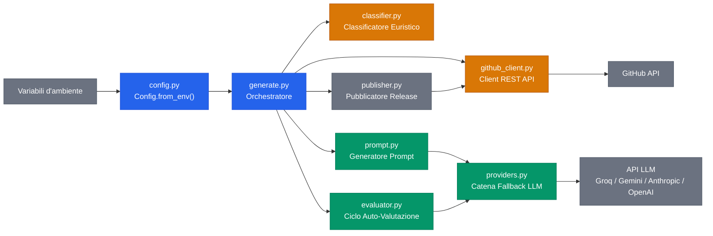

[English](README.md) | **Italiano**

# AI Changelog Generator

GitHub Action che genera changelog strutturati quando si pubblica una release. Recupera commit e PR mergiati tra due tag, li classifica secondo le convenzioni dei conventional commit, e produce un changelog in Markdown tramite LLM.

<div align="center">

[](https://github.com/marketplace/actions/ai-changelog-generator-by-bonn)
[](https://github.com/AndreaBonn/ai-changelog-generator/actions/workflows/test.yml)
[](https://github.com/AndreaBonn/ai-changelog-generator/actions/workflows/test.yml)
[](https://github.com/AndreaBonn/ai-changelog-generator/actions/workflows/test.yml)
[](https://docs.astral.sh/ruff/)
[](LICENSE)
[](https://www.python.org/downloads/)
[](SECURITY.md)

</div>

## Esempio di output


## Come funziona

1. Confronta il tag della release corrente con il precedente tramite le API GitHub.
2. Recupera commit e PR mergiati nell'intervallo.
3. Classifica le modifiche in categorie (breaking, feature, fix, performance, docs, chore) usando regole euristiche basate sui prefissi conventional commit e le label delle PR.
4. Invia i dati classificati a un LLM per generare un changelog leggibile.
5. Opzionalmente esegue un ciclo di auto-valutazione: l'LLM verifica il proprio output per breaking change mancanti o elementi inventati, e rigenera se necessario.
6. Pubblica il risultato come body della GitHub Release, e opzionalmente lo committa in `CHANGELOG.md`.

### Architettura



Per diagrammi dettagliati (sequenza pipeline, fallback provider, ciclo di auto-valutazione), vedi [docs/ARCHITECTURE.md](docs/ARCHITECTURE.md).

## Funzionalità

- Quattro provider LLM: Groq, Google Gemini, Anthropic, OpenAI
- Fallback chain tra provider: se un provider restituisce 429 o 5xx, viene provato il successivo
- Ciclo di auto-valutazione con comportamento fail-safe (non blocca mai la pubblicazione)
- Classificatore euristico per conventional commit e label delle PR
- Output del changelog in 5 lingue: inglese, italiano, francese, spagnolo, tedesco
- Prepend opzionale a `CHANGELOG.md` con commit `[skip ci]`

## Prerequisiti

Serve una API key da almeno un provider LLM:

| Provider | Ottieni la API key | Tier gratuito |
|---|---|---|
| Groq (default) | [console.groq.com](https://console.groq.com) | Si |
| Google Gemini | [aistudio.google.com](https://aistudio.google.com/apikey) | Si |
| Anthropic | [console.anthropic.com](https://console.anthropic.com) | No |
| OpenAI | [platform.openai.com](https://platform.openai.com/api-keys) | No |

Una volta ottenuta la key, aggiungila come secret del repository: **Settings → Secrets and variables → Actions → New repository secret**, con nome `LLM_API_KEY`.

## Quick start

Aggiungi questo file nel tuo repository sotto `.github/workflows/changelog.yml`:

```yaml
name: Changelog
on:
  release:
    types: [published]

jobs:
  changelog:
    runs-on: ubuntu-latest
    permissions:
      contents: write
    steps:
      - uses: actions/checkout@v4

      - uses: AndreaBonn/ai-changelog-generator@v1
        with:
          github_token: ${{ secrets.GITHUB_TOKEN }}
          llm_api_key: ${{ secrets.LLM_API_KEY }}
```

Questo usa Groq come provider predefinito. Vedi [Configurazione](#configurazione) per gli altri provider e le opzioni disponibili.

## Configurazione

Tutti gli input si impostano nel blocco `with:` dello step dell'action.

| Input | Richiesto | Default | Descrizione |
|---|---|---|---|
| `github_token` | sì | — | Token GitHub per accesso API e pubblicazione release |
| `llm_api_key` | sì | — | API key, separate da virgola, una per ogni provider |
| `llm_provider` | no | `groq` | Provider, separati da virgola per fallback chain (es. `groq,gemini`) |
| `llm_model` | no | *(default del provider)* | Override del modello per il primo provider |
| `language` | no | `english` | Lingua di output: `english`, `italian`, `french`, `spanish`, `german` |
| `update_changelog_file` | no | `false` | Se `true`, prepende il changelog a `CHANGELOG.md` e committa |
| `changelog_file_path` | no | `CHANGELOG.md` | Path del file changelog (usato solo se `update_changelog_file` è `true`) |
| `max_commits` | no | `100` | Numero massimo di commit da includere nel contesto LLM |
| `max_prs` | no | `30` | Numero massimo di PR mergiati da includere nel contesto LLM |
| `max_eval_retries` | no | `1` | Tentativi di auto-valutazione (0 disabilita la valutazione) |
| `max_tokens` | no | `4096` | Token massimi per la risposta LLM (aumentare per release grandi) |

### Modelli predefiniti per provider

| Provider | Modello predefinito |
|---|---|
| `groq` | `meta-llama/llama-4-scout-17b-16e-instruct` |
| `gemini` | `gemini-2.5-flash` |
| `anthropic` | `claude-sonnet-4-6` |
| `openai` | `gpt-4.1-mini` |

### Fallback multi-provider

È possibile specificare più provider per il fallback automatico. Fornire una API key per ogni provider, separate da virgola e nello stesso ordine:

```yaml
- uses: AndreaBonn/ai-changelog-generator@v1
  with:
    github_token: ${{ secrets.GITHUB_TOKEN }}
    llm_provider: groq,gemini
    llm_api_key: ${{ secrets.GROQ_KEY }},${{ secrets.GEMINI_KEY }}
```

Se il primo provider fallisce (rate limit, errore server, risposta vuota), l'action prova il successivo. È possibile ripetere un provider per ottenere più tentativi con la stessa key prima del fallback:

```yaml
llm_provider: groq,groq,gemini
llm_api_key: ${{ secrets.GROQ_KEY }},${{ secrets.GROQ_KEY }},${{ secrets.GEMINI_KEY }}
```

## Limitazioni note

- **La scoperta delle PR è O(N) sui commit**: l'action chiama le API GitHub una volta per commit per trovare le PR associate. Su release con molti commit (50+), questo può consumare una porzione significativa del rate limit delle API GitHub (5.000 richieste/ora per token autenticati). Gli input `max_commits` e `max_prs` aiutano a tenere il consumo sotto controllo.
- **Limite token output LLM**: il default è 4.096 token. Release con un numero molto elevato di modifiche possono produrre changelog troncati. Un warning viene loggato quando viene rilevato il troncamento. Usa l'input `max_tokens` per aumentare il limite.
- **Nessun caching**: ogni esecuzione recupera tutti i dati dalle API GitHub da zero.

## Sviluppo locale

Richiede Python 3.11+ e [uv](https://docs.astral.sh/uv/).

```bash
uv sync --dev                                      # Installa le dipendenze
uv run pytest tests/ -v --cov=changelog             # Esegui i test
uv run ruff check changelog/ tests/ generate.py     # Lint
uv run ruff format changelog/ tests/ generate.py    # Formattazione
uv run mypy changelog/ generate.py                  # Type check
```

## Contribuire

I contributi sono benvenuti. Apri una issue per discutere la modifica prima di inviare una pull request. Segui lo stile del codice esistente (applicato da ruff) e aggiungi test per le nuove funzionalità.

## Sicurezza

Per segnalare vulnerabilità, consulta [SECURITY.it.md](SECURITY.it.md).

## Licenza

Rilasciato sotto Apache License 2.0. Vedi [LICENSE](LICENSE).

Se usi questo progetto, l'attribuzione è richiesta: inserisci un link a questo repository e cita l'autore.

## Autore

Andrea Bonacci — [@AndreaBonn](https://github.com/AndreaBonn)

## Sostieni il progetto

AI Changelog Generator è gratuita. Se ti è utile e vuoi contribuire, puoi lasciare un'offerta tramite PayPal. L'importo lo scegli tu ed è del tutto facoltativo.

<div align="center">

[](https://paypal.me/AndreaBonacci19)

</div>

---

Se questo progetto ti è utile, una stella su GitHub è apprezzata.
