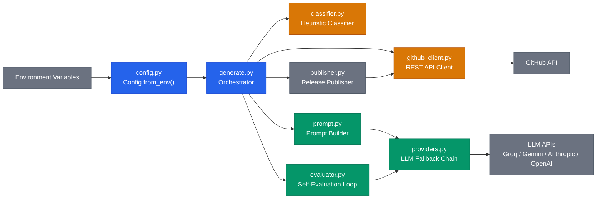

**English** | [Italiano](README.it.md)

# AI Changelog Generator

GitHub Action that generates structured changelogs when you publish a release. It fetches commits and merged PRs between two tags, classifies them using conventional commit conventions, and produces a Markdown changelog via LLM.

<div align="center">

[](https://github.com/marketplace/actions/ai-changelog-generator-by-bonn)
[](https://github.com/AndreaBonn/ai-changelog-generator/actions/workflows/test.yml)
[](https://github.com/AndreaBonn/ai-changelog-generator/actions/workflows/test.yml)
[](https://github.com/AndreaBonn/ai-changelog-generator/actions/workflows/test.yml)
[](https://docs.astral.sh/ruff/)
[](LICENSE)
[](https://www.python.org/downloads/)
[](SECURITY.md)

</div>

## Example output


## How it works

1. Compares the current release tag against the previous one via the GitHub API.
2. Fetches commits and merged PRs in that range.
3. Classifies changes into categories (breaking, features, fixes, performance, docs, chore) using heuristic rules based on conventional commit prefixes and PR labels.
4. Sends the classified data to an LLM to generate a human-readable changelog.
5. Optionally runs a self-evaluation loop: the LLM reviews its own output for missing breaking changes or hallucinated items, and regenerates if needed.
6. Publishes the result as the GitHub Release body, and optionally commits it to `CHANGELOG.md`.

### Architecture



For detailed diagrams (pipeline sequence, provider fallback, self-evaluation loop), see [docs/ARCHITECTURE.md](docs/ARCHITECTURE.md).

## Features

- Four LLM providers: Groq, Google Gemini, Anthropic, OpenAI
- Provider fallback chain: if one provider returns a 429 or 5xx, the next one is tried automatically
- Self-evaluation loop with fail-safe behavior (never blocks publishing)
- Heuristic classifier for conventional commits and PR labels
- Changelog output in 5 languages: English, Italian, French, Spanish, German
- Optional prepend to `CHANGELOG.md` with `[skip ci]` commit

## Prerequisites

You need an API key from at least one LLM provider:

| Provider | Get your API key | Free tier |
|---|---|---|
| Groq (default) | [console.groq.com](https://console.groq.com) | Yes |
| Google Gemini | [aistudio.google.com](https://aistudio.google.com/apikey) | Yes |
| Anthropic | [console.anthropic.com](https://console.anthropic.com) | No |
| OpenAI | [platform.openai.com](https://platform.openai.com/api-keys) | No |

Once you have your key, add it as a repository secret: **Settings → Secrets and variables → Actions → New repository secret**, named `LLM_API_KEY`.

## Quick start

Add this to your repository under `.github/workflows/changelog.yml`:

```yaml
name: Changelog
on:
  release:
    types: [published]

jobs:
  changelog:
    runs-on: ubuntu-latest
    permissions:
      contents: write
    steps:
      - uses: actions/checkout@v4

      - uses: AndreaBonn/ai-changelog-generator@v1
        with:
          github_token: ${{ secrets.GITHUB_TOKEN }}
          llm_api_key: ${{ secrets.LLM_API_KEY }}
```

This uses Groq as the default provider. See [Configuration](#configuration) for other providers and options.

## Configuration

All inputs are set in the `with:` block of the action step.

| Input | Required | Default | Description |
|---|---|---|---|
| `github_token` | yes | — | GitHub token for API access and release publishing |
| `llm_api_key` | yes | — | API key(s), comma-separated, one per provider entry |
| `llm_provider` | no | `groq` | Provider(s), comma-separated for fallback chain (e.g. `groq,gemini`) |
| `llm_model` | no | *(provider default)* | Override the default model for the first provider |
| `language` | no | `english` | Output language: `english`, `italian`, `french`, `spanish`, `german` |
| `update_changelog_file` | no | `false` | If `true`, prepend changelog to `CHANGELOG.md` and commit |
| `changelog_file_path` | no | `CHANGELOG.md` | Path to the changelog file (used only if `update_changelog_file` is `true`) |
| `max_commits` | no | `100` | Maximum commits to include in the LLM context |
| `max_prs` | no | `30` | Maximum merged PRs to include in the LLM context |
| `max_eval_retries` | no | `1` | Self-evaluation retries (0 disables evaluation) |
| `max_tokens` | no | `4096` | Maximum tokens for the LLM response (increase for large releases) |

### Default models per provider

| Provider | Default model |
|---|---|
| `groq` | `meta-llama/llama-4-scout-17b-16e-instruct` |
| `gemini` | `gemini-2.5-flash` |
| `anthropic` | `claude-sonnet-4-6` |
| `openai` | `gpt-4.1-mini` |

### Multi-provider fallback

You can specify multiple providers for automatic fallback. Provide one API key per provider entry, comma-separated and in the same order:

```yaml
- uses: AndreaBonn/ai-changelog-generator@v1
  with:
    github_token: ${{ secrets.GITHUB_TOKEN }}
    llm_provider: groq,gemini
    llm_api_key: ${{ secrets.GROQ_KEY }},${{ secrets.GEMINI_KEY }}
```

If the first provider fails (rate limit, server error, empty response), the action tries the next one. You can repeat a provider to get multiple attempts with the same key before falling back:

```yaml
llm_provider: groq,groq,gemini
llm_api_key: ${{ secrets.GROQ_KEY }},${{ secrets.GROQ_KEY }},${{ secrets.GEMINI_KEY }}
```

## Known limitations

- **PR discovery is O(N) on commits**: the action calls the GitHub API once per commit to find associated PRs. On releases with many commits (50+), this can consume a significant portion of the GitHub API rate limit (5,000 requests/hour for authenticated tokens). The `max_commits` and `max_prs` inputs help keep this under control.
- **LLM output token limit**: the default is 4,096 tokens. Releases with a very large number of changes may produce truncated changelogs. A warning is logged when truncation is detected. Use the `max_tokens` input to increase the limit.
- **No caching**: every run fetches all data from the GitHub API from scratch.

## Local development

Requires Python 3.11+ and [uv](https://docs.astral.sh/uv/).

```bash
uv sync --dev                                      # Install dependencies
uv run pytest tests/ -v --cov=changelog             # Run tests
uv run ruff check changelog/ tests/ generate.py     # Lint
uv run ruff format changelog/ tests/ generate.py    # Format
uv run mypy changelog/ generate.py                  # Type check
```

## Contributing

Contributions are welcome. Open an issue to discuss the change before submitting a pull request. Follow the existing code style (enforced by ruff) and add tests for new functionality.

## Security

For vulnerability reports, see [SECURITY.md](SECURITY.md).

## License

Released under the Apache License 2.0. See [LICENSE](LICENSE).

If you use this project, attribution is required: link back to this repository and credit the author.

## Author

Andrea Bonacci — [@AndreaBonn](https://github.com/AndreaBonn)

## Support the project

AI Changelog Generator is free to use. If it helps you and you want to give something back, you can leave a tip via PayPal. The amount is up to you and it is entirely optional.

<div align="center">

[](https://paypal.me/AndreaBonacci19)

</div>

---

If this project is useful to you, a star on GitHub is appreciated.
